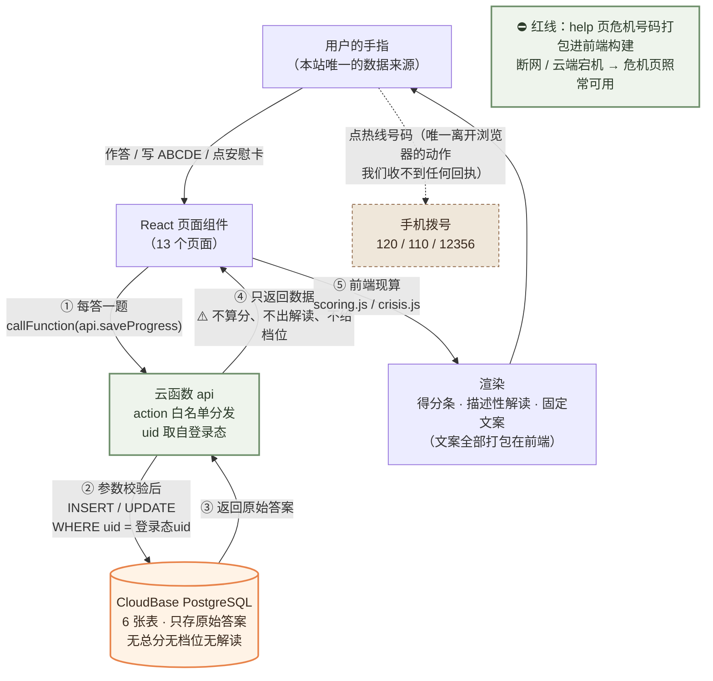

# 心屿 · 技术设计文档（TECH_DESIGN）

> Day 5 任务产出 ｜ **v2.0.1（云端全栈版）** ｜ 2026-09-23
> 上游文档：`PRD.md`（v4.0.1，Day 4）、`research.md`（Day 3）、`云端方案对比与影响评估.md`（决策记录）
> **版本史**：v1.0（2026-09-22）为纯静态路线，已随 commit `f0f4033` 推送；**2026-09-23 老板拍板改走云端全栈**，本文档整体重写为 v2.0；同日按课程三步清单复核，补 6.1 / 6.2 两张映射表、第 12 节改为未决项状态表（登录策略已拍板），升 v2.0.1。v1.0 全文可从 git 历史追溯（`git show f0f4033:TECH_DESIGN.md`）。
> 本文档回答一个问题：**这一版的技术怎么定，为什么这么定。** 不写代码，只写方案与理由。

---

## 1. 一句话说清数据从哪来、到哪去

> **用户在页面上操作 → React 页面通过云函数把数据写进 CloudBase PostgreSQL（每一行的归属 = 她的匿名身份 uid）→ 页面再从云函数把原始答案读回来，在前端现算、现渲染 → 换一台设备用同一身份打开，记录还在。**

拆成三句：

| 环节 | 具体是什么 |
|---|---|
| **数据从哪来** | **仍然只有一处：用户的手指。** 她答题、点安慰卡、写念头。**没有埋点、没有第三方接口、没有 AI 生成**——数据库里不会凭空多出她没写过的东西 |
| **数据到哪去** | **到 CloudBase PostgreSQL（腾讯云，上海地域）**，通过我们自己写的云函数写入。**每一行数据都挂在一个匿名 uid 上**，没有手机号、没有微信、没有姓名 |
| **数据被谁用** | **只被同一个 uid 下的页面自己用**——前端拿回的是**原始答案**，算分、判断档位、生成解读**全部在前端现算**。**服务端永远不存、也不算「结果长什么样」** |

**与 v1.0 一句话的差异**（必须诚实写出来）：v1.0 是「只进她自己的浏览器，我们看不到也收不到」；v2.0 是「**进我们的数据库，但只挂在匿名身份下**」。**「我们看不到」这句话从此不能再说**——关于页与隐私口径必须改写（见第 11 节 PRD 影响）。这是本次路线变更**最重的一笔代价**，不是技术细节。

> ⚠️ **两条不变的底线**：① 用户主动点热线号码（120 / 110 / 12356）调起拨号，照旧离开浏览器、我们收不到任何回执；② **危机资源页（help）的号码内容打包进前端代码**，不依赖任何接口——**断网、后端宕机，危机页照样能打开**。求助通道的可用性永远不押在云端可用性上。

---

## 2. 前后端与数据库分工：这次三样都真的有了

### 2.1 结论先行

| 角色 | 谁干 | 具体干什么 |
|---|---|---|
| **前端** | React + Vite 单页应用 | 13 个页面对应的路由组件；**算分、档位判断、解读渲染全部在前端**（原 `score.js` / `checkup.js` 逻辑平移） |
| **后端** | CloudBase 云函数（Node.js） | **1 个入口函数、12 个 action**：校验入参、读写数据库、**从登录态取 uid 强制隔离**。**它永远不算分、不生成解读** |
| **数据库** | CloudBase PostgreSQL | 6 张表（见第 5 节），只存**原始答案与记录原文** |
| **身份** | CloudBase 身份认证 · **匿名登录** | 打开页面静默获取 uid，无注册无密码（登录策略见第 12 节待定问题 1） |
| **托管** | CloudBase 静态网站托管 | 前端构建产物，内置 HTTPS + CDN |

### 2.2 一条贯穿全文档的安全设计（先立规矩）

1. **前端永远不传 uid。** 云函数从调用方的登录态里自己取 uid，前端伪造不了「我是别人」。数据隔离在服务端强制执行，不依赖前端自觉。
2. **服务端永远不存总分、档位、百分位、解读。** PRD 安全红线「不诱导自诊」在数据层的落法：数据库里**根本没有**可以泄出来的「诊断性字段」。要算，去前端拿原始答案现算。
3. **云函数持有数据库连接凭据，前端拿不到。** 即使前端代码被扒光，也只看到一个云函数名。
4. **固定文案永远是固定的。** 三种自评档位文案、安慰卡、危机号码全部打包在前端代码里，**服务端没有任何生成/拼接文字的代码路径**。

---

## 3. 技术路线：三方案对照与推荐

> 题面要求「先比较 2–3 套方案再推荐默认路线」。只说「选了 A」不算理由，**说出「为什么不选 B」才算**。

### 3.1 方案对照

| | **方案 A（推荐）** | 方案 B | 方案 C |
|---|---|---|---|
| 一句话 | **React/Vite + CloudBase 云函数 + CloudBase PostgreSQL + CloudBase 静态托管**（题面示范路线） | React/Vite + **Supabase 前端直连**（自动生成 API + RLS 行级权限）+ Vercel 部署 | React/Vite + CloudBase 云函数 + **CloudBase 文档型数据库** |
| 后端代码 | 自己写云函数（12 个 action） | **几乎不写**（Supabase SDK 直接 CRUD） | 自己写云函数 |
| 数据隔离靠 | **云函数从登录态取 uid**（服务端强制） | RLS 策略（数据库端声明式规则） | 云函数从登录态取 uid |
| 凭据暴露面 | 数据库连接串只在云函数环境变量里 | anon key **公开在前端 JS 里**（防线只剩 RLS） | 连接串只在云函数里 |
| 部署 | 一个控制台全包（函数+库+托管+认证） | Supabase + Vercel 两个账号、两个控制台 | 一个控制台全包 |
| 国内访问 | CloudBase 上海节点，快 | Supabase/Vercel 节点在海外，**深夜加载慢的风险真实存在** | 快 |
| 与课程对齐 | ✅ 题面示范路线 | ❌ 自选路线 | ⚠️ 半对（数据库换了） |
| 排期 | 基准（约 39~47 天，见 10.3） | 省约 2~3 天（不写函数层） | 基准差不多，但建表/迁移省一点 |

### 3.2 为什么推荐 A（逐条否掉 B 和 C）

**选 A 的核心理由是「隔离逻辑放在服务端代码里」，而不是「大厂全家桶」。**

1. **否掉 B（Supabase 直连）——两条：**
   - **隔离靠 RLS，对零基础太险。** RLS 是声明式策略，写错一条（比如忘了 `uid = auth.uid()` 条件）就是**全库裸奔**，而且错得很安静——不报错，只是数据能互相看到。云函数方案里，隔离是一行 `WHERE uid = $1`，在代码里看得见、可测试。
   - **anon key 公开在前端**是 Supabase 的正常设计（它就是这么用的），但意味着「防线只有一道」；A 方案是「连接串不落地 + 服务端校验」两道。对存着最私密内容的库，多一道是一道。
   - （次要：海外节点深夜加载慢；跨厂商要管两个账号、两套计费。）
2. **否掉 C（文档型数据库）——两条：**
   - **数据形态不合。** 测评作答是「结构固定、按人查询、要整体导出/删除」的数据，关系型天然合适；CloudBase PG 型环境（2026-08 起支持）与文档型环境**建环境时二选一、选了不能改**，第一步就要选对。
   - **SQL 是通用资产。** 建表、备份（`pg_dump`）、将来迁移，全是标准技能与标准工具；文档型是平台专有格式，进出都要适配。题面也明确指定 PostgreSQL。
3. **A 自身的代价，明码标价：** 要自己写 12 个 action + 建表 SQL + 迁移脚本，比 B 多约 2~3 天。**买的是「隔离可见、凭据不落地、校验有处放」**——对心屿这个数据敏感度，值。

### 3.3 为什么前端是 React + Vite（而不是保持原生 JS）

- 题面指定示范路线，课程后续教学也对齐这套。
- 13 个页面**共享导航、页脚求助入口、登录态、API 封装**——SPA + 组件化把 v1.0 里「每页复制一遍页脚」的重复消掉了；路由守业逻辑（答完才可进结果页）也有了统一落点。
- **组件文件长度放宽为软约束**：单文件尽量 ≤ 200 行，超了就拆组件——原硬约束「每页 1 个 JS ≤ 200 行」随路线一并放宽（见第 11 节 PRD 影响 #1）。

---

## 4. 项目结构（monorepo：前端 / 云函数 / SQL 三层）

```
心屿/
├── frontend/                     # React + Vite 前端
│   ├── index.html
│   ├── package.json              # ← v1.0「仓库无 package.json」约束就此翻篇
│   ├── vite.config.js
│   ├── .env.example              # VITE_TCB_ENV_ID= （示例文件入库；真值 .env 已被 .gitignore 拦截）
│   └── src/
│       ├── main.jsx              # 入口：初始化 CloudBase SDK + 匿名登录 + 路由
│       ├── App.jsx               # 布局壳：导航 + 页脚（页脚常驻危机入口，全站 ≤1 次点击）
│       ├── pages/                # 13 个组件，与 PRD 第 6 节页面清单一一对应
│       │   ├── Home.jsx          # 分区首页（index）
│       │   ├── Assessments.jsx / Test.jsx / Result.jsx / ResultLight.jsx
│       │   ├── Checkup.jsx / Breathe.jsx / Abc.jsx / Records.jsx
│       │   ├── Articles.jsx / Article.jsx / Help.jsx / About.jsx
│       ├── components/           # 得分条、安慰卡、危机提示条、加载/错误态等复用件
│       ├── lib/
│       │   ├── api.js            # callFunction 统一封装：超时/重试/错误码翻译（见第 8 节）
│       │   ├── auth.js           # 匿名登录、uid 获取、登录态恢复
│       │   ├── scoring.js        # 大五 5 维度 + 30 侧面算分（原 score.js 平移，纯算术）
│       │   ├── crisis.js         # 三种固定信号的判断（原 checkup.js 判断逻辑平移）
│       │   └── storage.js        # 本地草稿层：断网兜底（见 8.1），不是主存储
│       └── data/                 # 打包进构建的静态内容（题库/文案/号码），不是数据库
│           ├── ipip-neo.js       # 大五 120 题（含反向计分标记）
│           ├── lite-scales.js / lite-readings.js
│           ├── checkup.js / quotes.js / articles.js
│           └── hotlines.js       # 危机号码独立成文件：help 页断网可用的依据
├── cloudfunctions/
│   └── api/                      # 单一入口云函数（Node.js），按 action 分发
│       ├── index.js              # 路由：action → 处理器；统一 {code, message, data} 响应
│       ├── db.js                 # PG 连接池封装（复用连接，防每次冷启动都建连）
│       └── actions/              # 12 个 action 文件（清单见第 6 节）
├── sql/
│   └── migrations/
│       ├── 001_init.sql          # 6 张表 + 索引（见第 5 节）
│       └── 00N_xxx.sql           # 之后每次结构变更一个文件，顺序执行
└── PRD.md / research.md / TECH_DESIGN.md / 云端方案对比与影响评估.md
```

**为什么是「1 个云函数 + 12 个 action」而不是 12 个云函数**：免费环境函数配额有限；只部署调试一个入口；`db.js` 连接池天然共享。代价是入口代码要做显式 action 白名单分发——可接受的取舍。

---

## 5. 数据模型（PostgreSQL，6 张表）

> 设计原则只有一条：**数据库只存「用户写过的原始内容」与「行归属」，不存任何派生结果。** v1.0 的 9 个 localStorage key 到 6 张表的映射见 5.2。

### 5.1 建表 SQL（`sql/migrations/001_init.sql` 骨架）

```sql
-- ① 用户：只有匿名 uid，没有任何身份信息
CREATE TABLE users (
  uid           TEXT PRIMARY KEY,              -- CloudBase 身份认证 uid（匿名登录也发 uid）
  created_at    TIMESTAMPTZ NOT NULL DEFAULT now(),
  last_seen_at  TIMESTAMPTZ NOT NULL DEFAULT now()
);

-- ② 测评进度（断点续答）：大五/RSES/GSE/NFC/情绪自评 5 个共用
CREATE TABLE assessment_progress (
  uid         TEXT NOT NULL REFERENCES users(uid),
  scale_key   TEXT NOT NULL,                   -- 'bigfive'|'rses'|'gse'|'nfc'|'checkup'
  answers     JSONB NOT NULL DEFAULT '{}',     -- {"题号": 选项序号}
  updated_at  TIMESTAMPTZ NOT NULL DEFAULT now(),
  PRIMARY KEY (uid, scale_key)
);

-- ③ 已完成的测评提交（可多条 = 历史）
CREATE TABLE assessment_results (
  id          BIGINT GENERATED ALWAYS AS IDENTITY PRIMARY KEY,
  uid         TEXT NOT NULL REFERENCES users(uid),
  scale_key   TEXT NOT NULL,
  answers     JSONB NOT NULL,                  -- 全部答案明细
  created_at  TIMESTAMPTZ NOT NULL DEFAULT now()
  -- ⛔ 红线落法：没有 total_score 列、没有 percentile 列、没有 interpretation 列。
  --    解读由前端按题库 reading 编号现取——库里不存在「结果长什么样」这种数据。
);

-- ④ ABCDE 认知纠正记录（F9：用户写的原文，全站最私密的数据）
CREATE TABLE abc_records (
  id          BIGINT GENERATED ALWAYS AS IDENTITY PRIMARY KEY,
  uid         TEXT NOT NULL REFERENCES users(uid),
  a_event TEXT, b_thought TEXT, c_feeling TEXT, d_dispute TEXT, e_effect TEXT,
  created_at  TIMESTAMPTZ NOT NULL DEFAULT now(),
  updated_at  TIMESTAMPTZ NOT NULL DEFAULT now()
);

-- ⑤ 安慰卡累计次数（F8 的 xinyu.mood.count）
CREATE TABLE card_counters (
  uid         TEXT PRIMARY KEY REFERENCES users(uid),
  count       INT NOT NULL DEFAULT 0,
  updated_at  TIMESTAMPTZ NOT NULL DEFAULT now()
);

-- ⑥ 迁移账本：记录哪些脚本已应用（见第 10 节）
CREATE TABLE schema_migrations (
  version     TEXT PRIMARY KEY,
  applied_at  TIMESTAMPTZ NOT NULL DEFAULT now()
);

CREATE INDEX idx_results_uid_scale ON assessment_results (uid, scale_key, created_at DESC);
CREATE INDEX idx_abc_uid ON abc_records (uid, created_at DESC);
```

### 5.2 v1.0 的 9 个 key → v2.0 的去向（逐个交代）

| # | v1.0 key（localStorage） | v2.0 去向 | 说明 |
|---|---|---|---|
| 1 | `xinyu.assessment.answers` | `assessment_progress`（scale_key='bigfive'） | 每答一题调一次 `saveProgress` |
| 2 | `xinyu.assessment.result` | `assessment_results`（存答案，结果前端现算） | **只存答案明细，不存 `{domains, facets}`** |
| 3 | `xinyu.lite.answers` | `assessment_progress`（'rses'/'gse'/'nfc' 三行） | 原来一个 key 混存 3 量表，上云后**借机按量表分行**（跨设备续答更干净） |
| 4 | `xinyu.lite.result` | `assessment_results` | 同 #2 |
| 5 | `xinyu.checkup.answers` | `assessment_progress`（'checkup'） | 档位（normal/attention/crisis）**不落库**，前端每次从答案现算 |
| 6 | `xinyu.checkup.flag` | **不落库**（前端现算） | 红线：档位也是「结果」，库里不存 |
| 7 | `xinyu.abc.records` | `abc_records`（一行一条） | 数组变行，可单独删改 |
| 8 | `xinyu.mood.seen`（会话去重） | **不上云，留前端内存** | 本来就是「本次会话不重复」，刷新即重置是设计意图，上云反而错 |
| 9 | `xinyu.mood.count` | `card_counters` | 跨设备累计（「累计 >10 次给引导」的口径不变） |

---

## 6. API 列表（云函数 `api` 的 12 个 action）

> 统一约定：前端调 `callFunction('api', { action, payload })`；响应统一 `{code, message, data}`，**code=0 成功**，非 0 见第 8 节错误表。**所有 action 的 uid 一律取自登录态，payload 里传 uid 一律拒绝**（防伪造）。

| # | action | 输入 payload | 返回 data | 对应原 key / 页面 |
|---|---|---|---|---|
| 1 | `saveProgress` | scaleKey, answers | `{}` | key 1/3/5 的写 |
| 2 | `getProgress` | scaleKey | `{answers}` | 断点续答 |
| 3 | `completeAssessment` | scaleKey, answers | `{resultId}` | 答完最后一题，写提交记录 |
| 4 | `listResults` | scaleKey | `[{id, answers, createdAt}]` | 结果页 / 历史 |
| 5 | `listAbcRecords` | — | `[{id, a..e, createdAt}]` | records 页列表 |
| 6 | `saveAbcRecord` | id?, a, b, c, d, e | `{id}` | 新建/编辑 |
| 7 | `deleteAbcRecord` | id | `{}` | 删除单条 |
| 8 | `getCardCount` | — | `{count}` | 安慰卡引导判断 |
| 9 | `bumpCardCount` | — | `{count}` | 每次点卡 +1 |
| 10 | `exportAllData` | — | 该 uid 全部数据 JSON | 关于页「导出我的数据」 |
| 11 | `purgeAllData` | — | `{}` | 关于页「删除我的全部数据」 |
| 12 | `importFromStatic` | localStorage 快照（9 个 key 的 JSON） | `{导入条数统计}` | **静态版用户迁移**（见 10.2） |

### 6.1 表 → 页面 → API 读写映射（检查项：指着表说出页面与接口）

> 检查标准「能指着某张表说出它显示在哪个页面、由哪个接口读写」的落点。页面名与 PRD 第 6 节的 13 个页面对应。

| 表 | 谁写（API action） | 谁读（API action） | 显示在哪个页面 |
|---|---|---|---|
| `users` | 匿名登录时云函数自动 upsert（**没有对应的前端调用**） | 云函数内部（每次请求校验 uid） | 不直接显示（纯身份层，关于页显示「匿名身份」状态） |
| `assessment_progress` | `saveProgress`（每答一题） | `getProgress`（进入作答页续答） | **大五作答页**（test）、**3 个轻量表作答**（assessments 进入）、**情绪自评页**（checkup） |
| `assessment_results` | `completeAssessment`（答完最后一题） | `listResults`（结果页取历史） | **大五结果页**（result）、**轻量表结果页**（result-light）、**测评总览页**（assessments 的「已完成」标记与上次时间） |
| `abc_records` | `saveAbcRecord` / `deleteAbcRecord` | `listAbcRecords` | **认知纠正页**（abc 保存后回显）、**我的记录页**（records 列表与删除） |
| `card_counters` | `bumpCardCount`（每次点卡） | `getCardCount`（判断 >10 引导） | **分区首页**（index 的安慰卡引导行） |
| `schema_migrations` | 仅迁移脚本（**不暴露为 API**） | 仅迁移脚本 | 无页面（运维账本，见第 10.1 节） |

### 6.2 MVP 七功能 × 写入/读取动作 → API 或本地替代（检查项：每个动作有落点）

> 检查标准「每个 MVP 写入/读取动作都有 API 或本地替代方案」的落点。「本地替代」= 断网时用户仍然得到的东西（第 8.1 节草稿层 + 前端打包内容），不是第二套主存储。

| MVP 功能 | 用户动作 | 写入落点 | 读取落点 | 断网时（本地替代） |
|---|---|---|---|---|
| **F11 分区首页（分区一）** | 打开首页、点安慰卡 | `bumpCardCount` | `getCardCount`（>10 出引导行） | 卡片文案在前端 `data/quotes.js`，**断网照样出卡**；计数暂存草稿层，联网补记一次 |
| **F12 危机资源页** | 看号码、点拨号 | 无写入 | 无读取 | **无 API——号码打包在前端 `hotlines.js`，天然离线可用（红线，见第 1/8.2 节）** |
| **F1 大五测评** | 答题 / 完卷 / 看结果 | 每题 `saveProgress`；完卷 `completeAssessment` | 续答 `getProgress`；结果 `listResults` | 已答题目先落草稿层（storage.js），联网同步；断网时**续答用本地草稿**，结果页等联网后取 |
| **F6 情绪自评** | 答条目、看柔和文案 | `saveProgress`（scale_key='checkup'） | `getProgress` | 档位（normal/attention/crisis）由前端 `crisis.js` **从答案现算**，不依赖服务端；断网可答可看 |
| **F7 呼吸练习** | 呼吸循环 | **无写入（设计决定：不持久化）** | 无 | 纯前端 CSS 动画，天然离线可用 |
| **F8 随机安慰卡** | 点卡 | 同 F11（计数共用 `card_counters`） | 同 F11 | 同 F11 |
| **F9 保存动作** | 写 ABCDE、保存 | `saveAbcRecord` | `listAbcRecords` | **草稿层兜底（第 8.1 红线：绝不丢用户已写的内容）**——保存失败内容先落本地，恢复后重试 |

> **验证口径**：7 个 MVP 功能里，5 个有明确的 API 落点；F12 与 F7 是**有意不接 API**（静态内容 / 即时体验）——「没有 API」在这里是设计决定且有断网兜底，不是遗漏。加分项 8 个复用同一套 API（轻量表走 F1 同款、记录列表走 F9 同款、关于页走 `exportAllData` / `purgeAllData`）；知识库（F10）同 F12——正文打包在前端 `data/articles.js`，无 API、断网可读。**不另设任何接口。**


---

## 7. 前后端数据流（Mermaid）

### 7.1 全站数据流总图



**看图读法**：数据从手指进前端 → 过云函数（**它只是个搬运工兼门卫**：校验、隔离、落库）→ 落 PG；回来的是**原始答案**，算分与解读仍在前端。**云函数和数据库里不存在「这个用户的测评结果是什么」这种成品数据。**

### 7.2 一条典型链路：完成大五测评

1. 答第 1 题 → `saveProgress('bigfive', {...})` 落库（**每答一题落一次，中途关页面换设备也能续答**——这是上云后比 localStorage 强的地方）；
2. 答完第 120 题 → `completeAssessment` 写入一条 `assessment_results`；
3. 跳结果页 → `listResults('bigfive')` 取回答案 → **前端 `scoring.js` 纯算术聚合**（含反向计分）→ 按题库 reading 编号取描述性解读 → 渲染；
4. 第二天换电脑打开 → 同一 uid → 第 1、2 步的数据全在，结果照常现算出来。

---

## 8. 错误处理

> v1.0 的五条通用规则**全部延续**：不白屏、不静默失败、给用户说人话的提示、异常路径先写清楚再实现、兜底页可达。云端新增六类，**第一条是红线级**。

### 8.1 红线级：绝不丢用户已写的内容（本地草稿层）

**场景**：她深夜写 ABCDE，写到一半断网 / 云函数超时。
**处理**：`lib/storage.js` 作**草稿层**——表单内容**先落 localStorage（仅草稿）**，再异步同步云端；同步成功即清草稿，失败则**保留并在恢复后重试**。草稿层只服务这一件事，**不承担跨设备职责**（那是云端的事）——两条边界写死，防止悄悄滑回 v1.0 双轨架构。

### 8.2 其余六类

| 场景 | 处理 | 用户看到 |
|---|---|---|
| 云函数冷启动慢（首请求 1~3 秒） | api.js 统一 loading 态 + 15 秒超时 + 1 次自动重试 | 轻提示「正在同步」，不卡死 |
| 401 / 登录态过期 | auth.js **静默重新匿名登录** → 自动重发原请求 | 无感 |
| 限流 / 额度耗尽（code≠0） | 指数退避重试 2 次 → 仍失败给重试按钮 | 「稍后再试」，内容不丢（8.1 兜着） |
| 服务端 5xx / 数据库不可用 | 统一错误组件；**静态内容页（危机页/文章/安慰卡/呼吸）照常可用** | 「部分功能暂时不可用」+ 可用功能照常 |
| 两设备同时改一条 ABCDE | `updated_at` 新者胜；被覆盖前 `exportAllData` 可取全量 | 极少见，文档记录不特意提示 |
| 前端断网 | **危机页/安慰卡/呼吸/文章照常打开**（静态打包）；依赖云端的页面显示离线态 + 草稿已存 | 「已保存在本机，联网后同步」 |

---

## 9. 环境变量

> v1.0 的 `.env` 是占位；v2.0 它正式上岗。**原则：凡出现「环境 ID / 连接串 / 密钥」的地方，一律进环境变量，一个都不许硬编码。**

| 变量 | 放在哪 | 示例值 | 干什么用 |
|---|---|---|---|
| `VITE_TCB_ENV_ID` | `frontend/.env`（本地）与静态托管环境变量（线上） | `xinyu-prod-8gxxxx` | 前端 SDK 初始化指向哪个云环境 |
| `DB_HOST` / `DB_PORT` | 云函数环境变量（CloudBase 控制台配置，**不入库不入 git**） | 内网地址 | 云函数连 PG |
| `DB_NAME` / `DB_USER` / `DB_PASSWORD` | 同上 | — | 同上；**密码只存在于控制台** |
| `NODE_ENV` | 前端构建时 | `production` | Vite 按环境出包 |

- `.env.example` 入库（只有变量名和空值），`.env` 被 `.gitignore` 拦截——**这套机制 v1.0 的 .gitignore 已备好，今天启用**。
- 云函数侧不用 `.env` 文件，**在 CloudBase 控制台配环境变量**（函数运行时读取），天然不进代码仓库。

---

## 10. 迁移与运维注意事项

### 10.1 数据库结构变更：编号迁移脚本

- 每次改表 = 新增一个 `00N_xxx.sql`，**永不修改已应用过的脚本**；
- `schema_migrations` 表记录已应用版本，应用前先查账本，**重复应用直接跳过**；
- 上线前在免费环境先跑一遍全量迁移，**本地不装 PG**（用 CloudBase 控制台的 SQL 窗口），零基础少养一个本地服务。

### 10.2 从静态版（v1.0，如有用户）迁移

- 静态版数据在她浏览器 localStorage 里；云端版关于页提供 **「从旧版导入」**：读 9 个 key 的 JSON → 调 `importFromStatic` 按第 5.2 节映射写入 → 成功后**旧数据原样保留在本地不删**（用户自己清）；
- **没有「批量迁移全体用户」这回事**——静态版我们连谁在用都不知道（这正是 v1.0 的隐私设计），导入只能一对一、用户主动触发。

### 10.3 运维红线（云端版新增的三条「必须有人记得」）

| # | 红线 | 说明 |
|---|---|---|
| 1 | **免费体验环境不自动续费**：单次续 6 个月，**忘记续 → 隔离 → 未转付费即销毁** | 心屿上云后**最大的单点风险不是技术，是记性**。上线即设日历提醒（到期前 30 天） |
| 2 | 免费额度 3000 点/月，**不支持加购**；超量要先升级付费套餐 | 上线后看用量；心理自助小站的量级大概率够用（估算，非实测） |
| 3 | **备份**：每月 `pg_dump` 一份落到本地（手动即可，量级小） | 数据库一旦是「我们的」，备份就是我们的责任，没有借口 |

### 10.4 排期影响（结论，任务级重排在 PRD v5.0 做）

**25 天 → 约 39~47 天**（决策文档第 2.2 节已逐阶段算过：React 学习 +3~5、骨架 +2、云函数 +4~6、数据模型 +1~2、认证 +1~2、联调异常 +2~3、部署 +1~2）。**本文档不重排 25 个任务**——那是 PRD v5.0 的活，本文档只负责把账算在这里。

---

## 11. 与 PRD v4.0.1 的冲突清单（8 处，PRD v5.0 处理）

> 本节是**变更台账**，不是变更本身。PRD v4.0.1 暂不动，v5.0 重写时逐条落实；每条都已在决策文档第 2.1 节论证过。

| # | PRD 位置 | 冲突 | v5.0 要做什么 |
|---|---|---|---|
| 1 | 第 5.0.4 节 九条硬约束 | 八条被推翻（框架/构建/package.json/npm/第三方库/每页 200 行/异步/无后端）；「不写手绘 SVG」**保留** | 重写约束清单：保留项 + 放宽项 + 新增项（如「单文件 ≤200 行软约束」「.env 不入库」） |
| 2 | 第 10.2C 节 验收 7 条 | 全部失效（尤其「双击 index.html 就能跑」） | 改为云端版验收：迁移脚本可重放、云函数 action 白名单、错误码全覆盖 |
| 3 | 第 9 节 「注册登录永不做」 | 匿名登录已进架构 | 改写为「不做真实注册，匿名身份 + 可选绑定」（**待老板确认**，见第 12 节） |
| 4 | 第 1.1/1.3 节 定位 | 「打开就能用」需重新表述 | 匿名登录下改为「无需注册，打开即用」——**前提是匿名登录真的静默无感** |
| 5 | 第 8B 节 隐私 | 「我们看不到也收不到」**不能再说** | 改写为「数据加密存储于腾讯云、仅挂在匿名 ID 下、可随时导出/彻底删除」+ 给出导出/删除入口 |
| 6 | 第 13 节 风险表 | 新增「云端数据泄露」高风险 | 对策即本文档 2.2 四条设计 + 10.3 备份红线 |
| 7 | F13 关于页 | 文案与「数据在哪」的描述全部过时 | 按 #5 重写；加「从旧版导入」入口 |
| 8 | 第 11.2 节 25 天排期 | 装不下 | 重排 ~40 天任务表 |

---

## 12. 尚未决定的地方（题面要求：明确标注）

> 状态更新（2026-09-23 课程清单复核）：问题 1（登录策略）**已由老板拍板**，从待定项移入定案；其余 4 项仍未决，动工（Day 7-8）前需要答案的只有 #2（云账号归属）。

| # | 问题 | 状态 | 说明 / 影响面 |
|---|---|---|---|
| 1 | **登录策略** | ✅ **已拍板（2026-09-23）** | **默认匿名登录**（打开页面静默发 uid，无任何注册界面）+ 关于页提供**可选绑定**（绑定后跨设备）。⚠️ 匿名 uid 在清除浏览器数据后不可恢复，此限制要写进关于页。影响面：首页文案、关于页、auth.js |
| 2 | 云账号归属 | ⏸ 未决 | 临时假设：老板个人腾讯云账号 + 实名，免费体验环境起步。**Day 7-8 动工前必须定**（没有环境什么都做不了） |
| 3 | 域名 | ⏸ 未决 | 临时假设：先用 CloudBase 默认域名，不买域名。影响上线链接形态 |
| 4 | GitHub 仓库角色 | ⏸ 未决 | 临时假设：仓库继续托管**源代码**（部署产物走 CloudBase，不走 GitHub Pages）；Git 与提交节奏不变。仅影响部署环节 |
| 5 | 旧静态版交付物 | ⏸ 未决（倾向不动） | 临时假设：git 历史里的 v1.0 原样保留（`f0f4033`），不删不改。影响面：无 |

---

## 13. 来源与核实说明

| # | 内容 | 状态 | 出处 / 说明 |
|---|---|---|---|
| 1 | CloudBase 支持 PostgreSQL（2026-08 起）；**PG 型与文档型环境建环境时二选一不可改**；上海地域支持 | ✅ 官方直读（2026-09-22） | CloudBase《产品概述》《资源点价格文档》官方博客；明细见决策文档第 5 节 |
| 2 | 免费体验环境 3000 点/月、单次续 6 个月不自动续费、逾期隔离销毁；各资源单价 | ✅ 官方直读 | 同上 |
| 3 | 身份认证支持匿名登录等 10+ 方式；静态托管内置 HTTPS+CDN | ✅ 官方直读 | 同上 |
| 4 | 「+14~22 天」「免费额度够用」 | ⚠️ **估算非实测** | 决策文档 2.2 / 2.4 节，已标注 |
| 5 | 9 个 key 名称与字段、13 个页面清单、安全红线 | ✅ 项目内部定案 | `PRD.md` v4.0.1；本文档只做「key → 表」映射，**字段口径未改** |
| 6 | 表结构、API 清单、错误处理矩阵 | **本次新设计** | 设计依据 = 第 2.2 节四条安全规矩 + v1.0 已定案的红线；**未经实现验证，动工时（Day 7-8 改云端版）如与现实冲突，先回来改本文档** |

---

## 附：v2.0 自查

| 检查标准（题面） | 结果 | 证据 |
|---|---|---|
| **先比较 2–3 套方案再推荐** | ✅ | 第 3 节：三方案对照 + 逐条否掉 B/C 的理由 + A 自身代价明码标价 |
| **项目结构** | ✅ | 第 4 节：frontend / cloudfunctions / sql 三层 monorepo |
| **数据模型** | ✅ | 第 5 节：6 张表 DDL 骨架 + 9 个 key 逐个映射 + 红线落法（无总分列） |
| **API 列表** | ✅ | 第 6 节：12 个 action，含输入输出与防伪造约定 |
| **表 → 页面 → API 可指认** | ✅ | 第 6.1 节：6 张表逐一写明写入/读取接口与显示页面（v2.0.1 补） |
| **MVP 读写动作全部有落点** | ✅ | 第 6.2 节：7 个 MVP 功能逐个列出 API 或「有意无 API + 断网兜底」（v2.0.1 补） |
| **前后端数据流** | ✅ | 第 7 节：总图（Mermaid）+ 大五测评典型链路 |
| **错误处理** | ✅ | 第 8 节：红线级「绝不丢用户已写的内容」+ 六类矩阵 |
| **环境变量** | ✅ | 第 9 节：变量表 + 前端/云函数两侧的存放规则 |
| **迁移注意事项** | ✅ | 第 10 节：脚本账本 / 旧版导入 / 续期与备份红线 / 排期结论 |
| **信息不足先列问题** | ✅ | 第 12 节：5 个问题（#1 登录策略已拍板，#2 云账号归属为动工前必答项）+ 临时假设 |
| **安全红线延续** | ✅ | 服务端无诊断性字段（5.1）；危机页断网可用（1/8.2）；档位前端现算（5.2 #6）；固定文案打包在前端（2.2） |
