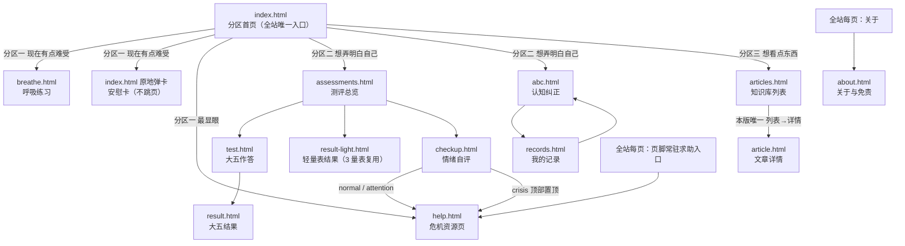
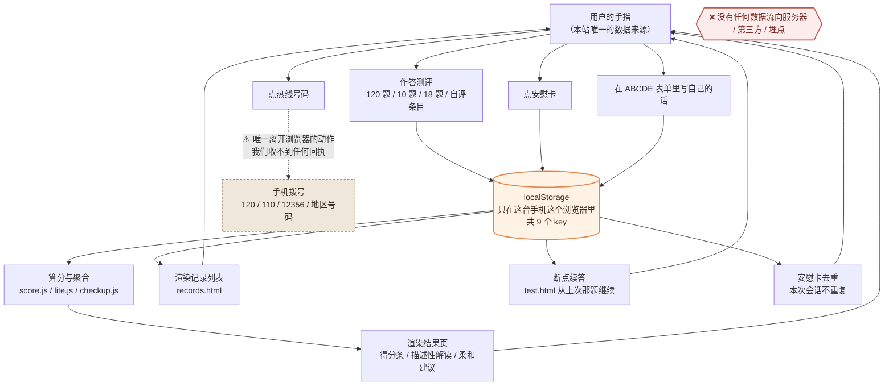
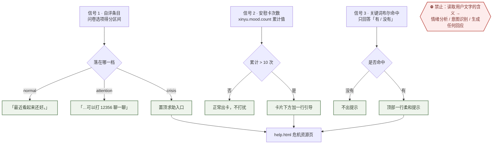

# 心屿 · 技术设计文档（TECH_DESIGN）

> Day 5 任务产出 ｜ **v1.0** ｜ 2026-09-22
> 上游文档：`PRD.md`（v4.0.1，Day 4）、`research.md`（Day 3 需求研究）
> 本文档回答一个问题：**这一版的技术怎么定，为什么这么定。** 不写代码，只写方案与理由。

---

## 1. 一句话说清数据从哪来、到哪去

> **用户在自己手机上操作 → 数据只写进这台手机浏览器自己的 localStorage → 页面自己读出来算、自己渲染 → 关掉网页数据仍在，但谁也拿不走。**

拆成三句：

| 环节 | 具体是什么 |
|---|---|
| **数据从哪来** | **只有一处：用户的手指。** 她答题、点安慰卡、写念头；**没有第二个数据源**——没有后端数据库，没有第三方接口，没有埋点，也没有 AI 生成 |
| **数据到哪去** | **只到一处：她这台浏览器自己的 localStorage。** 不发给我们的服务器（我们根本没有服务器），不发给任何人 |
| **数据被谁用** | **只被同一个浏览器里的页面自己用**——算分、渲染结果、回看记录 |

**一句话的反面同样重要**：**「从哪来、到哪去」这两端之间没有任何外部环节。** 没有 API 调用，没有云端同步，没有登录态，没有 Cookie 上报。这也是为什么本站敢在关于页写「你的所有内容只存在你自己的浏览器里，我们看不到，也收不到」——**这句话不是承诺，是架构事实**。

> ⚠️ **唯一的例外必须说明**：**用户主动点热线号码**（120 / 110 / 12356 等）会调起手机拨号，这一步会离开浏览器。但那是她自己的动作，且**我们收不到任何回执**——本站没有任何代码能知道她拨了没有、拨给谁。

---

## 2. 前后端与数据库分工：本站三样都没有

### 2.1 结论先行

题面要求说清「前后端与数据库分工」。对大多数网站，答案是一张三级分工表。**对心屿，答案是这张表整个不成立**——因为本站**没有后端、没有数据库、没有网络请求**。

| 题目里的角色 | 常规网站里它是干什么的 | 心屿里有吗 | 心屿里归谁干 |
|---|---|---|---|
| **前端** | 页面、交互、渲染 | ✅ **有** | **13 个 HTML 页面 + 1 个 `style.css` + 每页 1 个 JS**，全部是前端 |
| **后端** | 处理请求、执行业务逻辑、鉴权 | ❌ **没有** | **原来后端干的活，全部搬到浏览器里**：算分、判断分支、读写数据 |
| **数据库** | 持久化存储、多设备共享 | ❌ **没有** | **localStorage 顶替**。代价见 2.3 |

### 2.2 「后端被搬进了浏览器」——四件事的归属对照

没有后端不等于这些事不用做，只是换了个地方做。逐条交代：

| 常规网站里由后端负责的事 | 心屿里谁做 | 具体在哪做 |
|---|---|---|
| **计算**（量表算分、维度聚合） | 浏览器 JS | `score.js`（大五 5 维度 + 30 侧面）、`lite.js`（轻量表映射解读文案）、`checkup.js`（自评分支） |
| **业务规则**（谁能看结果、何时触发求助） | 浏览器 JS | 「答完才可访问结果页」用**作答状态判断**实现；危机触发用**三种固定信号**判断（见 5.3） |
| **数据持久化** | 浏览器 localStorage | `storage.js` 统一封装读写（全部包 `try/catch`） |
| **用户身份 / 权限** | **不做** | 无登录、无账号、无权限。**任何人打开都是同一个站，只是各自看到自己的本地数据** |
| **内容分发**（文章正文） | 静态 JS 数据文件 | `data/articles.js`——文章是**打包进代码**的，不是从接口拉的 |

> **一句话**：**后端不是「省掉了」，是「移到了用户设备上」。** 因此本站的服务器只需要做一件事：**把静态文件发出去**（GitHub Pages 干的就这一件事）。

### 2.3 没有数据库的代价（不装看不见）

| 代价 | 具体表现 | 本版怎么处理 |
|---|---|---|
| **数据只在单台设备、单个浏览器** | 手机答完换电脑看，没有 | **明确接受**。关于页写清「只存在你自己的浏览器里」；第 2.4 节列为本版不做 |
| **清缓存 / 无痕模式就没了** | Safari 无痕下写不进 localStorage | PRD 第 8 节异常 1：**页面照常可用**，顶部一行浅色提示告知「这次不会保留」，不报错、不白屏 |
| **存储上限约 5MB** | 长期攒的 ABCDE 记录可能写满 | PRD 第 8 节异常 2：捕获 `QuotaExceededError`，提示并给「去删旧记录」按钮，**绝不静默失败** |
| **没有跨设备统计** | 无法知道有多少人用、用了什么 | **本来就不要**——PRD 第 9 节把「数据统计 / 埋点」列为**永不做**（心理类产品的行为埋点涉及敏感隐私） |

> **判断（非数据证明）**：这三条代价里，只有第一条是用户能感知的**功能缺失**；后两条在本站的定位下反而**变成了优点**（隐私 = 差异化）。所以「不上后端」不是一个将就，是**与「不登录、免费、即用即走」这个定位一致的必然选择**。此判断待上线后用真实用户反馈验证。

---

## 3. 技术路线

### 3.1 技术路线（一行话）

> **纯静态前端：HTML + CSS + 原生 JavaScript，零依赖、零构建、零后端，数据用 localStorage，托管在 GitHub Pages。**

### 3.2 技术栈逐项与理由

| 层 | 选什么 | 为什么选它 |
|---|---|---|
| **结构** | HTML5，**13 个独立 `.html` 文件**（不用前端路由） | 零基础可直接看懂「一个页面 = 一个文件」；页面间用 `<a href>` 跳转，**不需要任何路由库** |
| **样式** | 手写CSS3，1 个共用 `style.css` + 少量页内样式 | 调性要求统一（奶油底 / 蜜桃橙 / 雾绿），共用一份变量最省事；不用预处理器（Sass）因为要装编译工具 |
| **逻辑** | **原生 JavaScript（ES5/ES6 基础语法）**，每页 1 个 `.js`，≤ 200 行 | 全站逻辑简单到不需要框架：数组运算、DOM 渲染、读写 localStorage |
| **数据** | `localStorage` + `data/*.js` 静态数据文件 | 前者存用户数据，后者存题库与文案（**题库是代码的一部分，不是数据库**） |
| **托管** | **GitHub Pages**（免费静态托管） | 无服务器、无费用、和已建好的仓库天然打通；推送即发布 |
| **框架** | **不用**（React / Vue 全不用） | 见 3.4 |
| **构建** | **不用**（webpack / vite 全不用，**仓库无 `package.json`**） | 见 3.4 |
| **数据库** | **不用** | 见第 2 节 |

### 3.3 一次典型的用户操作，技术上发生了什么

以「完成大五测评看到结果」为例，把技术路线串起来（**全程没有任何网络请求**）：

1. 用户在 `test.html` 点一个选项；
2. `test.js` 把这一题写进 `xinyu.assessment.answers`（**每答一题就写一次**，所以中途退出能续答）；
3. `test.js` 更新进度条（改一个 `<div>` 的宽度百分比）；
4. 答完最后一题 → 调 `score.js`：把 120 个选项值按维度与侧面**纯算术聚合**（含反向计分）；
5. 算出的 `{domains, facets}` **写进 `xinyu.assessment.result`**；
6. 跳到 `result.html` → `result.js` 从 localStorage 读回那份结果 → **用 JS 现算每条得分条的宽度百分比** → 渲染；
7. 用户关掉网页。**数据还在她手机里**，下次打开 `result.html` 仍然看得到。

> **注意第 6 步**：结果**不是**被后端算好存起来的，是**每次打开都用本地数据现算的**。所以只要 localStorage 里的作答还在，结果就永远能重新算出来——这也是「清空数据」等于「回到出厂状态」的原因。

### 3.4 被否掉的方案与理由（为什么暂时选这一条）

> 题面要求「技术路线有理由」。只说「选了 A」不算理由，**说出「为什么不选 B」才算**。

#### 方案对照

| 方案 | 是什么 | 排期（25 天上限） | 零基础可行性 | 评价 |
|---|---|---|---|---|
| **① 纯静态 + localStorage** | 13 个 HTML + 原生 JS + 本地存储 + GitHub Pages | **够**（25 个任务刚好填满 25 天） | ✅ 会写 HTML 就能开始 | ✅ **采用** |
| ② 静态前端 + 第三方后端服务（Firebase / Supabase） | 数据存云、可跨设备 | ❌ 不够（要多学账号体系、云端读写、异步、安全规则，保守 +7~10 天） | ⚠️ 高（异步 + 云控制台概念） | ❌ 否 |
| ③ 框架 + 构建（React / Vue + Vite） | 组件化、工程化 | ❌ 不够（要先学会工具链，保守 +10~15 天） | ❌ 很高（零基础头号劝退点） | ❌ 否 |

#### 逐条说明「否掉的原因」

**否掉方案 ②（加云端后端）——三条，任一成立即否决：**

1. **直接破坏定位。** 数据上云就必须有用户身份，否则无法区分「谁的数据」；而**「不用登录」是本站写在首屏的差异化命门**（`research.md` 结论 + PRD 第 1.3 节）。为了省「换设备看不到」这一条小遗憾，去牺牲整个定位，不划算。
2. **与安全红线方向相反。** 本站目标用户含心境障碍人群，用户写的是**最私密的话**（F9 里那句「我就是不行」）。**把这些内容收进我们自己的数据库，等于主动接过一份不该接的责任**——泄露一次就是不可挽回的伤害，而我们没有能力做数据安全。**留在用户自己浏览器里，是我们能给的最强保护。**
3. **排期真的不够。** 25 天已经一天一个任务排满（PRD 第 11.2 节），**没有任何缓冲**。加云端至少要再占 7~10 天，等于把已定案的路线 A 推翻。

**否掉方案 ③（上框架 + 构建）——两条：**

1. **违反 PRD 第 5.0.4 节的零基础硬约束**（不用框架 / 不用构建 / 无 `package.json` / 不引第三方库）。这不是审美偏好，是**已写死的可检查约束**——检查方式就是「仓库里没有 `package.json`、克隆下来双击就能跑」。
2. **收益在本站几乎为零。** 框架解决的是「大型应用的状态管理与组件复用」。本站 13 个页面、每页逻辑不超过 200 行、**状态就是几个 localStorage key**，没有需要框架的地方。**引框架是纯粹的成本，没有对应的收益。**

#### ⚠️ 这条路线在什么情况下会被推翻

技术选型不是终身制的。**触发条件（本版不做，触发条件明确）**：

| 触发条件 | 那时该换什么 |
|---|---|
| 上线后 30 天内自然访问 **≥ 500 次**，且**有 ≥ 20 位用户主动要求「换手机也能看到我的记录」** | 才评估引入后端（PRD 第 9 节已有的同口径触发条件） |
| 需要跨设备同步 / 用户账号 / 投稿 UGC | 那时**必须**引入云端，同时要**重新做一遍隐私与合规评估**（数据一上云，关于页那段「我们看不到也收不到」就得全部改写） |

> **判断（非数据证明）**：一个纯静态、无后端的小站，在「不上线广告、不做增长」的前提下，达到上述量级的可能性不高。**因此本版不需要为「将来可能要上云」预留任何技术设计**——真到那一天，13 个页面的规模重写也不亏。此判断待上线后用真实数据验证。

---

## 4. 系统结构

### 4.1 文件结构（本版最终形态）

```
心屿/
├── index.html            分区首页（三区）
├── assessments.html      测评总览（5 个测评）
├── test.html             大五作答页
├── result.html           大五结果页
├── result-light.html     轻量表结果页（3 个量表复用）
├── checkup.html          情绪自评页
├── breathe.html          呼吸练习页
├── abc.html              认知纠正（ABCDE 表单）
├── records.html          我的记录
├── articles.html         知识库列表
├── article.html          知识库详情
├── help.html             危机资源页
├── about.html            关于与免责
├── style.css             全站唯一样式表（颜色变量、卡片、按钮、布局）
├── storage.js            localStorage 统一读写封装（try/catch 全包）
├── score.js              大五算分（5 维度 + 30 侧面）
├── lite.js               轻量表作答与结果渲染
├── checkup.js            自评作答与分支判断
├── abc.js                表单读存
├── breathe.js            呼吸动画与计时
├── articles.js / article.js
├── index.js / test.js / result.js / records.js / about.js / assessments.js
└── data/
    ├── ipip-neo.js       大五 120 题（含反向计分标记）
    ├── lite-scales.js    3 个轻量表题库（RSES / GSE / NFC-18）
    ├── lite-readings.js  轻量表描述性解读文案
    ├── checkup.js        自评条目 + 三种固定文案
    ├── quotes.js         安慰语 30 条
    └── articles.js       知识库 4 篇正文
```

**硬约束回顾**：**没有 `package.json`、没有 `node_modules`、没有 `.env` 之外的构建配置**。`data/` 目录里的 `.js` 文件**不是数据库**，是**打包进代码的静态内容**——它们变的是「代码」，不是「数据」。

### 4.2 页面依赖关系（谁跳到谁）



> **两条硬规则**：① **任意页面到 `help.html` ≤ 1 次点击**（页脚常驻入口）；② **任何页面都不许「无路可走」**——至少能回首页、能到危机页（PRD 第 6.2 节 C）。

---

## 5. 数据流图

### 5.1 全站数据流总图（数据从哪来、到哪去）



**看图读法**：**左边只有「用户的手指」一个源头，中间只有「localStorage」一个落点，右边回到用户眼前。** 那个红框是本图的重点——**图上没有一条线指向服务器**。

### 5.2 用户数据流逐条（9 个 key：什么时候写、什么时候读、读了干什么）

| # | key | 什么时候**写** | 什么时候**读** | 读了之后**干什么** |
|---|---|---|---|---|
| 1 | `xinyu.assessment.answers` | **每答一题**立刻写 | 进 `test.html` 时 | **断点续答**：算出「上次答到第几题」，从那一题继续；进度条按已答数量渲染 |
| 2 | `xinyu.assessment.result` | 答完最后一题 | 进 `result.html` 时 | 渲染 5 个维度得分条与解读；30 个侧面默认折叠 |
| 3 | `xinyu.lite.answers` | 每答一题 | 进轻量表作答时 | 续答；判断是否已答完 |
| 4 | `xinyu.lite.result` | 答完某量表最后一题 | 进 `result-light.html` 时 | **只按 `reading` 文案编号取一段描述性解读**——不取分数（因为**根本没存分数**） |
| 5 | `xinyu.checkup.answers` | 每答一题 | 自评作答中 | 更新进度（前 3 题内必须出现进度提示） |
| 6 | `xinyu.checkup.flag` | 自评结束时 | 结果页 + 首页 | 决定显示三种柔和文案中的哪一种；`crisis` 时**把求助入口顶到结果区最顶部** |
| 7 | `xinyu.abc.records` | 点「保存这次记录」 | `records.html` | 渲染记录列表；点开看自己写的原文；可删单条 |
| 8 | `xinyu.mood.seen` | 每次点安慰卡 | 点安慰卡时 | **本次会话内去重**——同一条不出现两次 |
| 9 | `xinyu.mood.count` | 每次点安慰卡 | 点安慰卡时 | **累计 > 10 次**就在卡片下方加一行柔和引导 + 进危机页的按钮 |

### 5.3 三条安全数据的流向（本设计最重要的一张图）

本站有三条通道会把用户导向求助资源。**它们全部只用「固定的、非文字」的信号**——这是 PRD 封死的边界。



> **为什么专门画这张图**：本站**看起来**有两套容易混淆的机制——「结果文案必须固定、不可动态生成」和「三条触发点导向求助」。
> **它们不矛盾**。真正的边界不是「文案是不是死的」，而是「**分支依据来自哪里**」：
> - 允许：**问卷选项、点击次数、关键词有没有命中**（三种都是程序能数的东西）；
> - 一律禁止：**读懂用户写的话，再回一句安慰**——那会立刻变成聊天机器人，是 PRD 第 9 节明确「永不做」的方向。
>
> 所以关键词命中后显示的那句话，必须是**预先写死在代码里的固定句子**，不能由代码拼装，更不能由模型生成。

---

## 6. 方案变化影响面

> 排期越紧，越需要知道「改一个地方会牵动多少文件」。此表用于**改动前先估成本**。

| 如果发生这个变化 | 必须改的文件 | 影响面 | 为什么 |
|---|---|---|---|
| 大五题量从 120 改 60 | `data/ipip-neo.js`（题库）+ `score.js`（维度聚合）+ `test.js`（进度分母）+ `result.html`（侧面说明文案） | **中** | 题量是 4 个文件的共同常量，不是一处配置 |
| 轻量表从 3 个减到 2 个 | `data/lite-scales.js` + `data/lite-readings.js` + `assessments.html`（卡片数） | **小** | 模板复用，只删数据与一张卡 |
| **换掉某个量表**（如 RSES 换 IPIP 自尊子量表） | 题库 + 解读文案 + **`about.html` 的授权说明** + **PRD 第 5.2 节版权表** | **小但必须同步** | ⚠️ **授权说明是对外承诺，换量表不同步关于页＝虚假标注** |
| 新增文章（4 篇 → 5 篇） | `data/articles.js` + `articles.html`（卡片数） | **小** | 内容与列表两处 |
| 危机页号码变更 / 过期 | `help.html` + `about.html`（核实日期汇总）+ **PRD 第 5.1 节 F12 表** + 第 15 节来源表 | **中** | ⚠️ **号码散落在文档与页面两处，且「标注核实日期」是上线硬门槛** |
| **换成加了后端 / 登录** | **全部 13 个页面重写 + 新增服务端 + 关于页隐私声明全部改写 + PRD 第 0 节分层与第 10.1 节合规门槛重评** | **极大（等于重做）** | 这是定位级变化，不是功能级变化 |
| 改分区名称（如「现在有点难受」→「情绪急救」） | `index.html` + **PRD 第 5.1 节 F11 表 + 第 10.2 节验收** | **小但必须同步** | ⚠️ **分区标题六个禁用词是可 grep 的验收项** |
| 新增 1 个 localStorage key | `storage.js` + 用它的页面 + **PRD 第 7 节 9 个 key 表 + 第 10.3 节技术验收** | **中** | ⚠️ 本版**只允许 9 个**，新增必须先改 PRD（v2 的情绪日记 `xinyu.mood.log` 就是这么处理的） |

**一条通用规律**：**「改数据」影响面小（1~2 个文件），「改口径」影响面大（要连带改 PRD 与验收）。** 因为本站的验收标准大量是可 grep 的字面条件——**文档与代码必须同时改，只改一边就会前后矛盾。**

---

## 7. 风险与对策（技术侧）

| 风险 | 等级 | 对策 |
|---|---|---|
| **localStorage 写不进去 / 写满 / 数据损坏** | **高** | `storage.js` 统一封装，**每一次读写都包 `try/catch`**；写失败必须提示用户（不许静默失败）——对应 PRD 第 8 节异常 1/2/3，实现任务 **T13b** |
| 零基础被「做图表」卡住 | **中高** | **不写手绘 SVG**：得分条用 `<div>` 宽度百分比，呼吸动画用 CSS `transform: scale()`（PRD 第 5.0.4 节第 5 条） |
| **改一处忘另一处，文档与实现不一致** | **中高** | 建立第 6 节的「变化 → 影响面」习惯；**改口径时全文搜旧口径的所有出现位置**（Day 4 复核证明：九处修订里六处是跨章节自相矛盾） |
| 老浏览器不支持新语法 | 中 | 不用可选链 `?.`、空值合并 `??`；布局用 Flexbox + 百分比，不用 Grid 新特性（PRD 第 8 节异常 10） |
| 每页 JS 越写越长超过 200 行 | 中 | 按页拆文件 + 复杂逻辑下沉到 `score.js` / `storage.js` / `data/`；PRD 第 10.2C 节有「逐个数行数」这条验收 |
| 无痕模式 / 禁用 JS 导致白屏 | 中 | 写 `<noscript>`；localStorage 不可用时**页面照常可用**，只是顶部加一行提示（PRD 第 8 节异常 1/8） |
| GitHub Pages 缓存导致改了没生效 | 低 | 上线后改动用硬刷新验证；不引入 Service Worker（本版不做离线缓存） |

---

## 8. 来源与核实说明

**本文档的性质**：第 1~7 节的技术结论**全部来自本项目的既有决策**（`PRD.md` v4.0.1 与 `research.md`），不是本次新做的外部调研。唯一在本次做了核实的，是下面第 3 条。

| # | 内容 | 状态 | 出处 / 说明 |
|---|---|---|---|
| 1 | 「不用框架 / 无 `package.json` / 不写异步 / 不写手绘 SVG」等 9 条零基础约束 | **项目内部已定案** | `PRD.md` 第 5.0.4 节与第 10.2C 节。**可逐条 grep 检查**，不是原则性表述 |
| 2 | 9 个 localStorage key 的名称与字段 | **项目内部已定案** | `PRD.md` 第 7 节。本文档第 5.2 节的「何时写 / 何时读」为**本次新增的技术侧细化**，key 名称与字段未做任何改动 |
| 3 | **PHQ-9 / GAD-7「无需许可即可复制、翻译、展示、分发」（public domain 口径）** | ✅ **本次新增核实**（公开资料 + 权利方官方渠道转述） | Pfizer 作为法定版权方明确表示 no permission required to reproduce, translate, display or distribute；多个独立来源一致（ICHOM 参考指南、Lancet Psychiatry 综述性文章、第三方平台的授权声明页）。⚠️ **本文件只核实授权，不改变用法限制**——本站对二者的使用仍受 PRD 第 10.1 节约束：**只用条目，不给总分、不给分级、不给百分位** |
| 4 | **PHQ-9 的官方分级带**（0-4 / 5-9 / 10-14 / 15-19 / 20-27） | **已核实，但本项目明确不用** | 公开文献一致。⚠️ **这些分级带正是 PRD 禁止输出给用户的东西**——文档里记录下来，是为了让「不给分级」这个决定有据可依，而不是给实现留口子 |
| 5 | **GitHub 原生渲染 Mermaid**（` ```mermaid ` 围栏代码块） | ✅ **本次核实** | GitHub 官方文档《创建关系图》明确载明支持 mermaid，`graph TD; A-->B;` 为官方示例语法。故本文档的数据流图选用 Mermaid，**推送后可在 GitHub 网页直接看到渲染结果**，便于交作业截图 |
| 6 | 「上线 30 天 ≥ 500 次访问才评估后端」等触发条件 | **项目内部已定案** | `PRD.md` 第 9 节。⚠️ **这是一个未经验证的数字**，作用是「给决策一个边界」，不是预测。真到那天须重新评估 |

**方法局限（必须说明）**：本文档**不含任何新增的用户调研数据**。第 2.3 节的「代价判断」、第 3.4 节的「换云端的可能性不高」均属**推断（非数据证明）**，已在正文标注为待验证。技术选型的最终依据是**排期约束 + 零基础可行约束 + 隐私定位**这三条项目内部约束，而非性能或成本的量化比较——因为本项目不具备做量化比较的条件（没有后端、没有流量、没有成本压力）。

---

## 附：Day 5 自查

| 检查标准（题面） | 结果 | 证据 |
|---|---|---|
| **TECH_DESIGN.md 已完成** | ✅ | 本文件，9 个章节 + 附录 |
| **技术路线有理由** | ✅ | 第 3.4 节**三个方案对照表 + 逐条说明否掉原因 + 触发条件**。不只说「选了纯静态」，还说清「为什么不选云端后端」（三条：破坏定位 / 与安全红线相反 / 排期不够）与「为什么不上框架」（两条：违反已写死的硬约束 / 收益为零） |
| **数据流图能说清数据从哪来、到哪去** | ✅ | 第 1 节**文字版一句话 + 三句话拆解**；第 5.1 节**全站数据流总图**；第 5.2 节**逐条说明 9 个 key 何时写、何时读、读了干什么**；第 5.3 节**三条安全通道的流向图**。三张图 + 一张表互为印证 |
| **是否与 PRD 一致** | ✅ | 逐条比对：13 个页面名、9 个 key 名、技术约束、安全边界**全部沿用 PRD v4.0.1，未做任何改动**。本文档只做技术侧细化（把「何时写 / 何时读」补齐），**不新增功能、不改数据字段** |
| **本文档与 PRD 的分工** | ✅ | **PRD 说「做什么」（功能与验收），本文档说「怎么做与为什么这么定」（结构与取舍）**。两份文档的页面清单与数据字段必须逐字一致——第 6 节「方案变化影响面」就是维持一致性的工具 |
